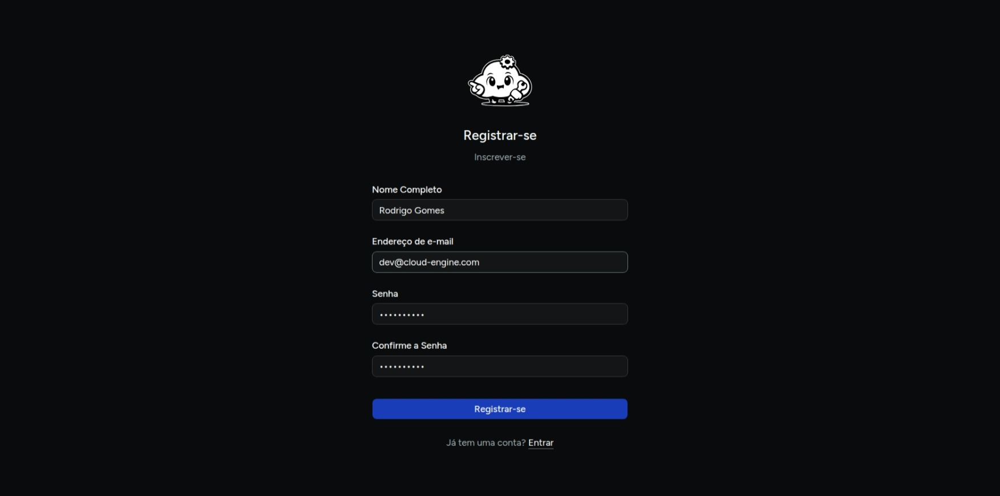
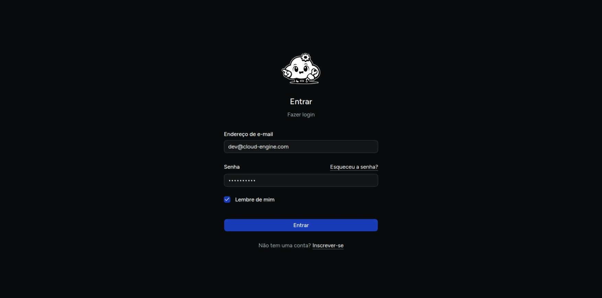
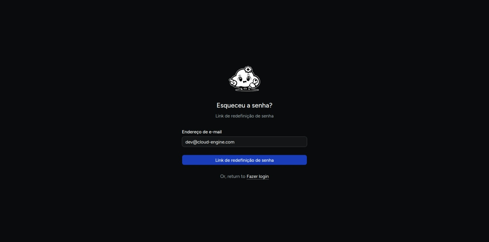
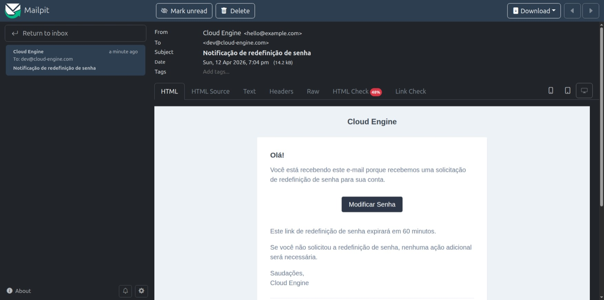

# Criar conta e login

O primeiro passo para usar o Cloud Engine é criar sua conta e acessar a plataforma.

## Criar conta

Se o ambiente estiver com cadastro aberto, use a tela de registro para criar um novo acesso.

1. Acesse a página de cadastro.
2. Preencha **nome completo**, **e-mail**, **senha** e **confirmação de senha**.
3. Clique em **Registrar**.



## Fazer login

1. Acesse a página de login.
2. Informe seu **e-mail** e **senha**.
3. Se desejar, marque **Lembrar-me**.
4. Clique em **Entrar**.



Depois da autenticação, o fluxo principal leva você para a área de **servidores**.

## Recuperar acesso

Quando o recurso estiver habilitado no ambiente, a tela de login também exibe a opção **Esqueci minha senha** para iniciar a redefinição de senha.



Para ter acesso ao e-mail de recuperação de senha no ambiente de desenvolvimento abra o console do mailpit pelo ddev:
O mailpit é uma ferramenta de teste de e-mail que captura mensagens enviadas pela aplicação, permitindo que você visualize e teste o processo de recuperação de senha sem precisar de um servidor de e-mail real.

```bash
ddev mailpit
```

