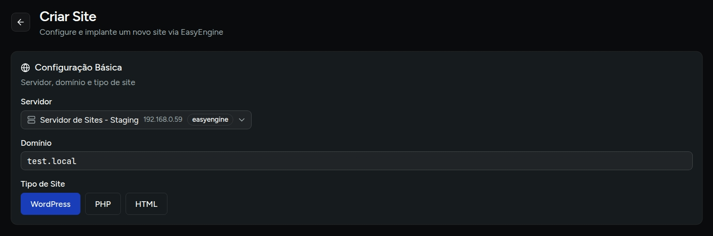
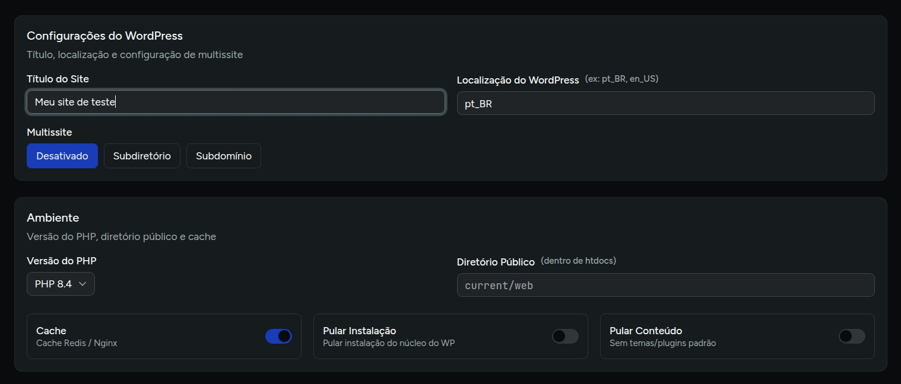
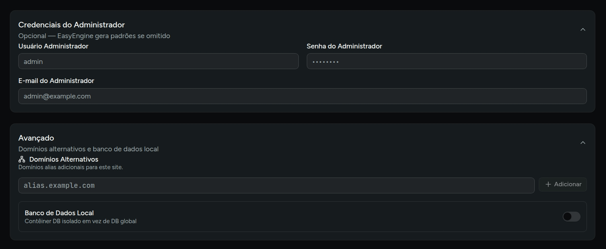
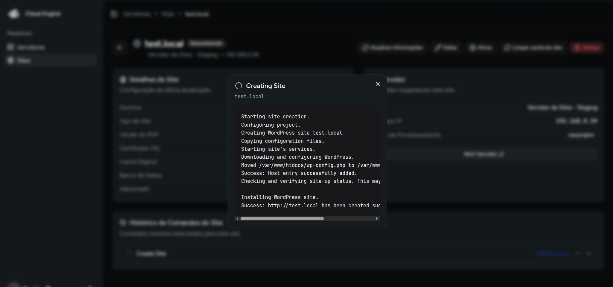

# Criar site

Depois que o servidor estiver provisionado com **EasyEngine**, você pode criar sites diretamente pela tela global de sites ou a partir do detalhe de um servidor.

## Pré-requisitos

- servidor cadastrado no Cloud Engine;
- engine de provisionamento configurada como **EasyEngine**;
- domínio principal definido para o site. (em desenvolvimento pode ser um domínio fictício, como `test.local`)

:::info
Ao registrar um dominio fictício, certifique-se de que ele esteja mapeado para o IP do servidor no arquivo `hosts` da sua máquina local para fins de teste.
:::

## Como criar

1. Acesse **Sites** e clique em **Criar site**.
2. Escolha o **servidor**.
3. Informe o **domínio**.
4. Selecione o tipo do site: **WordPress**, **PHP** ou **HTML**.
5. Preencha as opções adicionais exibidas para o tipo escolhido.
6. Revise o **preview do comando**.
7. Clique em **Criar site**.

## Configurações básicas

| Campo | Uso |
| --- | --- |
| **Servidor** | VPS onde o site será criado. |
| **Domínio** | Domínio principal do site. |
| **Tipo** | Define o fluxo e os parâmetros de criação: `wp`, `php` ou `html`. |

## Opções para WordPress

Quando o tipo selecionado é **WordPress**, o formulário libera campos extras:

- **Título do site**
- **Locale** do WordPress, como `pt_BR` ou `en_US`
- modo **Multisite**
- credenciais opcionais do administrador
- opção para **não instalar** o core
- opção para **não incluir conteúdo padrão**

## Opções de ambiente

Para sites **PHP** e **WordPress**, também ficam disponíveis:

- versão do **PHP**
- diretório público dentro de `htdocs`
- ativação de **cache** 

## Opções avançadas

No bloco avançado você pode definir:

- **domínios alias**;
- uso de **banco local**;
- dados opcionais do administrador no caso de WordPress.

:::warning
A opção de banco local está gerando um erro de validação de conexão por TLS no EasyEngine por hora é recomendada apenas para ambientes de desenvolvimento, e irá atrasar o processo de provisioanmento.
:::

## O que acontece após criar

Depois do envio:

- o Cloud Engine inicia a operação de forma assíncrona;
- você é redirecionado para a página do site;
- o andamento pode ser acompanhado pelo modal de execução do comando.

