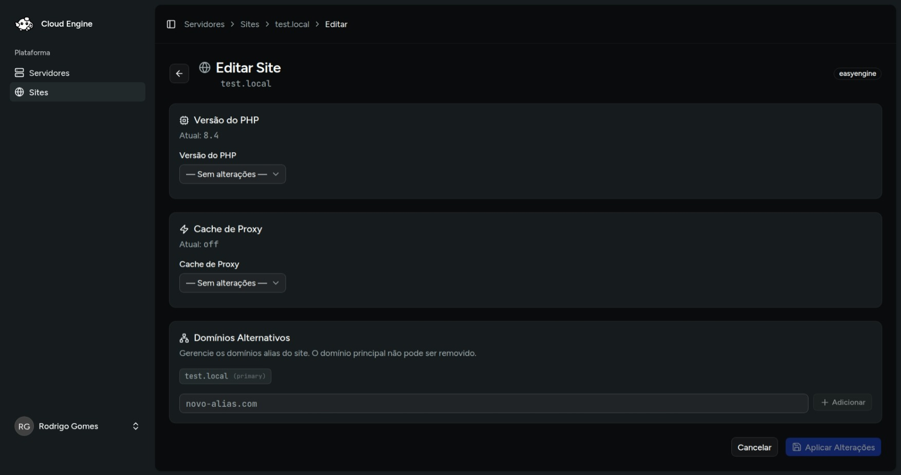

# Editar site

A edição do site permite aplicar ajustes sem recriar a instalação. O formulário atual foi pensado principalmente para sites **PHP** e **WordPress** executados com EasyEngine.

## Como acessar

1. Entre em **Sites**.
2. Abra o site desejado.
3. Clique em **Editar**.

## Alterações disponíveis

### PHP

Você pode escolher uma nova versão de **PHP**. O formulário trabalha com a ideia de **sem alteração** por padrão, então apenas o que for selecionado será enviado.

### Proxy cache

Para sites PHP ou WordPress, a tela permite:

- ativar o proxy cache;
- desativar o proxy cache;
- definir limite de tamanho;
- definir tempo máximo de cache.

### Domínios alias

Também é possível:

- adicionar novos aliases;
- remover aliases existentes;
- revisar um resumo visual do que será incluído ou removido.

O domínio principal do site não pode ser removido.

## Preview dos comandos

Quando houver alterações, o Cloud Engine exibe um **preview dos comandos** que serão executados. Se houver mais de uma mudança, elas são aplicadas como **comandos separados, em sequência**.

## Aplicar mudanças

1. Faça os ajustes desejados.
2. Revise o preview.
3. Clique em **Aplicar alterações**.
4. Aguarde o processamento assíncrono da operação.

## Observações

- se nenhuma alteração for selecionada, a atualização não é enviada;
- o comportamento de edição depende da engine configurada no servidor;
- o histórico da execução pode ser acompanhado na página do site após o envio.

