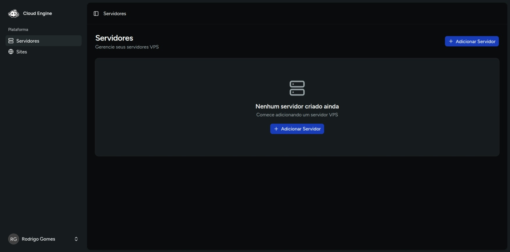

# EasyEngine

O **EasyEngine** é a primeira engine suportada pelo Cloud Engine. Com ele, você consegue conectar um servidor, executar o provisionamento inicial e gerenciar o ciclo de vida dos sites a partir de uma interface unificada.

Para saber mais sobre o EasyEngine, consulte a [documentação oficial do EasyEngine CLI](https://easyengine.io/cli/).

## Fluxo recomendado

1. Registrar uma conta e fazer login na plataforma.
2. Cadastrar o servidor com acesso SSH válido.
3. Executar o provisionamento do servidor.
4. Instalar o EasyEngine.
5. Criar e administrar os sites.

## O que está coberto neste guia

- [Criação de conta e login](../account-and-login.mdx)
- [Cadastro de servidor](../create-server.mdx)
- [Provisionamento com as receitas disponíveis](../provision-server.mdx)
- [Criação de sites WordPress, PHP e HTML](../create-site.mdx)
- [Ações de gerenciamento do site](../site-functions.mdx)
- [Edição de configurações do site](../edit-site.mdx)

## Antes de começar

Antes de seguir os próximos passos, tenha em mãos:

- IP do servidor VPS e Porta SSH
- Pelo menos uma chave privada com acesso ao servidor via usuário root
- Um domínio configurado para o site *(opcional — em ambientes de teste, você pode usar `test.local` ou similar)*

