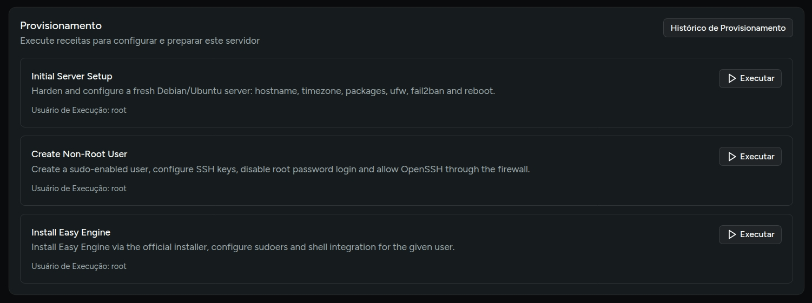
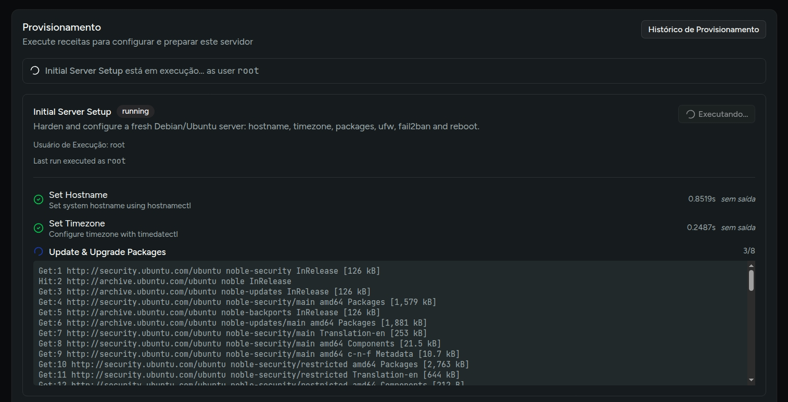
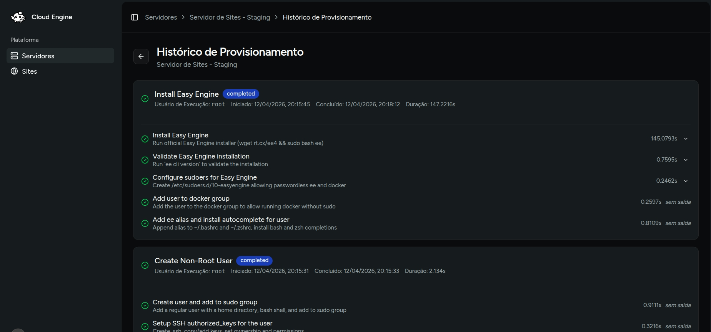

# Provisionar servidor

O provisionamento prepara a VPS para uso no Cloud Engine. Na tela do servidor, a seção **Provisionamento** exibe as receitas disponíveis e o histórico das execuções.

## Onde executar

1. Abra a lista de **Servidores**.
2. Entre no servidor desejado.
3. Localize o card **Provisionamento**.
4. Escolha a receita e execute a ação.



## Ordem sugerida para EasyEngine

Com base nas receitas atuais do projeto, a sequência mais segura é:

1. **Initial Server Setup**  
   Faz a configuração inicial do servidor, incluindo hostname, timezone, atualização de pacotes, UFW, Fail2ban e reinicialização.
2. **Create Non-Root User**  
   Cria um usuário com sudo, ajusta chaves SSH e reforça a configuração de acesso.
3. **Install Easy Engine**  
   Instala o EasyEngine, configura permissões necessárias e ativa a integração da engine no servidor.

:::warning
Nesta faze inicial do projeto não é possível configurar as opções de hostname e timezone, as opções estão fixas na receita. Em breve, essas opções poderão ser personalizadas durante a execução. Mas você pode modificar o arquivo da receita presente na pasta `app/Core/Provisioning/Recipes/Setup/InitialServerSetupRecipe.php` do projeto para ajustar essas configurações, alterando os valores padrão no construtor da classe:
```php
public function __construct(
        private readonly string $hostname = 'ee-setup-server',
        private readonly string $timezone = 'America/Sao_Paulo',
    ) {}
```
:::

## Como acompanhar

Durante a execução, o Cloud Engine mostra:

- status da receita em tempo real;
- etapa atual em andamento;
- saída parcial dos comandos;
- histórico completo na tela **Provisioning History**.



## Regras importantes

- apenas **uma execução por vez** pode ficar ativa no mesmo servidor;
- algumas receitas exigem um usuário SSH específico;
- quando a instalação do EasyEngine é concluída, o servidor passa a ser marcado com a engine **easyengine**;
- se o usuário `easyengine` existir no servidor, ele também pode se tornar o usuário padrão de execução.

## Histórico de provisionamento

A tela de histórico permite auditar:

- horário de início e fim;
- usuário usado na execução;
- duração total;
- resultado de cada etapa;
- mensagens de erro, quando houver falha.


