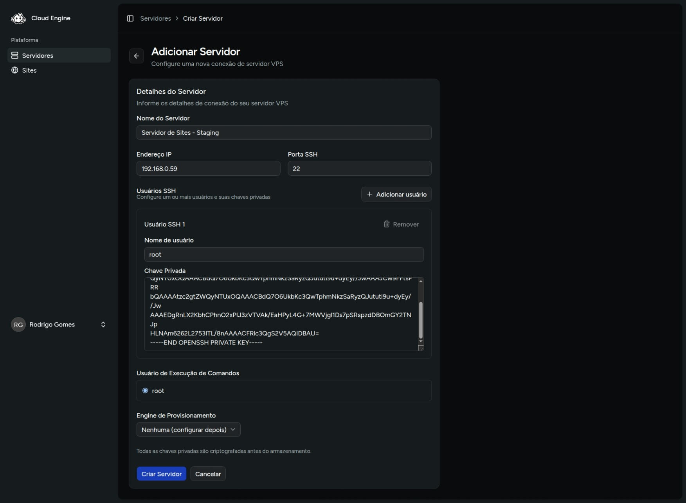
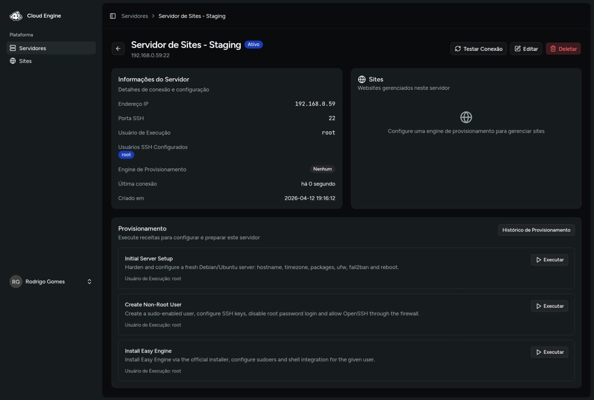

# Registrar um servidor

O cadastro do servidor é a etapa que conecta sua VPS ao Cloud Engine. A partir dela, o sistema consegue executar testes de conexão, provisionamento e operações nos sites.

1. Acesse **Servidores**.
2. Clique em **Adicionar servidor**.
3. Preencha os dados de conexão.
4. Escolha o usuário que será usado para execução dos comandos.
5. Defina a engine de provisionamento.
6. Clique em **Criar servidor**.

## Campos principais

| Campo | Descrição |
| --- | --- |
| **Nome do servidor** | Identificação interna da VPS no painel. |
| **IP do servidor** | Endereço IP público da máquina. |
| **Porta SSH** | Porta usada para acesso SSH, normalmente `22`. |
| **Usuários SSH** | Lista de usuários que poderão ser usados na conexão. Cada item recebe usuário e chave privada. |
| **Usuário de execução** | Usuário que o Cloud Engine usará para rodar comandos remotos. |
| **Engine** | Pode ficar como **Nenhuma** para configurar depois, ou **EasyEngine** se o servidor já estiver pronto. |

## Boas práticas

- Comece com usuário **root** caso seja a primeira configuração do servidor, para garantir acesso total e evitar erros de permissão. Depois, adicione usuários com privilégios adequados para as operações do Cloud Engine.;
- Mantenha a chave privada correta para cada usuário configurado;
- Use **Nenhuma** como engine quando o servidor ainda não estiver provisionado;
- Após instalar o EasyEngine, o servidor passa a ser associado a essa engine.

## Resultado esperado

Depois de salvar, o servidor aparece na listagem e você pode abrir a página de detalhes para:

- acompanhar informações do servidor;
- iniciar o provisionamento;
- criar sites quando a engine já estiver configurada.

