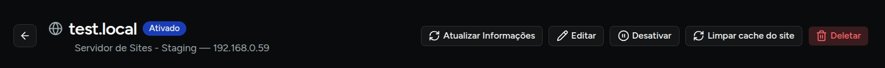
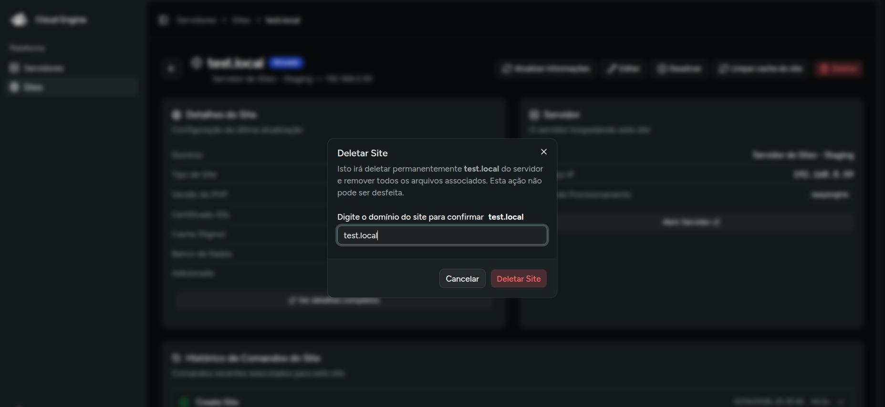

# Funções de site

Na página de detalhes do site, o Cloud Engine concentra as ações operacionais mais comuns para o dia a dia.

## Onde acessar

1. Vá para **Sites**.
2. Clique em **Gerenciar** no site desejado.
3. Use os botões de ação no topo da página.

## Ações disponíveis

### Ativar ou desativar

O sistema mostra o estado atual do site e alterna a ação disponível:

- **Desativar** quando o site está ativo;
- **Ativar** quando o site está desativado.

Essa ação é enviada para o EasyEngine e processada de forma assíncrona.

### Limpar cache

Use **Limpar cache do site** para limpar o cache do site.

:::info
Essa ação só está disponível para sites PHP ou WordPress que tenham o cache de redis ou proxy cache ativado.
:::

### Atualizar informações

O botão **Refresh info** força uma nova leitura das informações do site no servidor para atualizar os dados exibidos na interface.

### Deletar

Ao excluir um site:

1. o sistema abre uma janela de confirmação;
2. você precisa digitar o **domínio** do site;
3. somente depois disso a exclusão é liberada.

:::danger
Excluir um site é uma ação sensível. Antes de confirmar, verifique se o domínio digitado está correto e se você já possui backup do conteúdo necessário.
:::

## Acompanhamento das ações

As ações de site geram uma execução acompanhável pelo Cloud Engine, com status como:

- `pending`
- `running`
- `completed`
- `failed`

