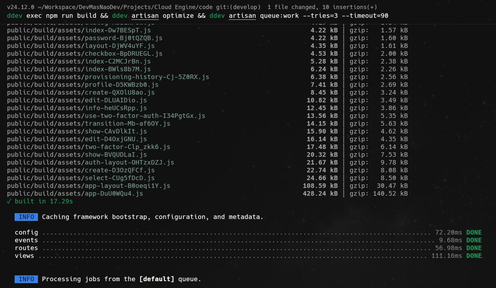

# Instalação

:::warning
**Projeto em estágio inicial:** o Cloud Engine ainda está em desenvolvimento ativo e **não está pronto para uso em produção**. Utilize apenas para testes, avaliação e ambientes controlados.
:::

Este guia descreve como preparar o ambiente local do **Cloud Engine** com base no fluxo atual do projeto.

## Pré-requisitos

Antes de começar, instale:

1. **Docker**
2. **DDEV**

:::info
Instalar o ddev pode ser feito seguindo a [documentação oficial](https://ddev.readthedocs.io/en/stable/#installation), ou você pode assistir ao meu vídeo tutorial sobre o processo de instalação do DDEV, disponível no meu canal do YouTube: [Instalando o DDEV](https://youtu.be/GW3qFxcVQAU?si=ScYJ7hEsPpB3xypZ).
:::

## Configuração do ambiente

Clone o repositório do projeto

```bash
git clone https://github.com/devmasnaodev/cloud-engine.git
```

Acesse a pasta do projeto e inicie o ambiente com DDEV:

```bash
cd cloud-engine
ddev start
```

Instale as dependências e faça o bootstrap da aplicação:

```bash
ddev composer run setup
```

## Executando a aplicação

Se quiser rodar a aplicação em um modo mais próximo do uso real, utilize:

```bash
ddev exec npm run build && ddev artisan optimize && ddev artisan queue:work --tries=3 --timeout=90
```

